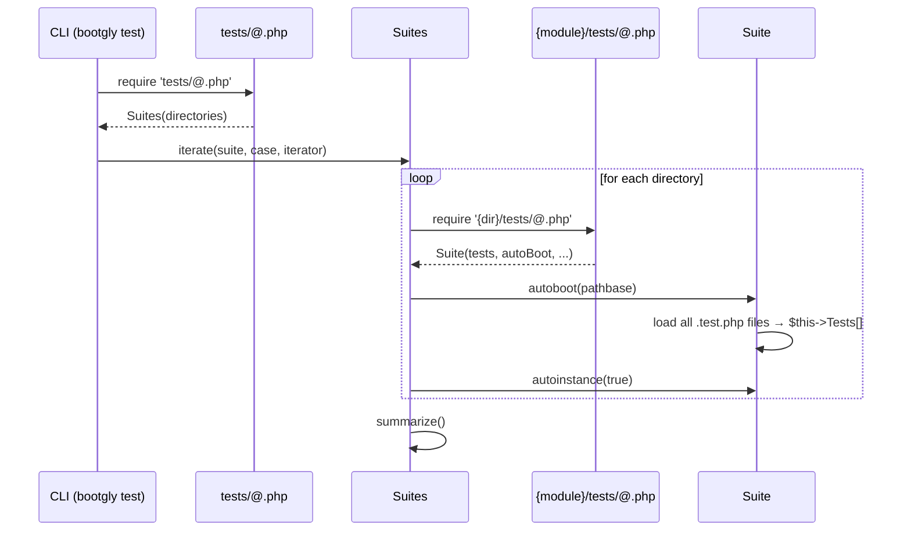
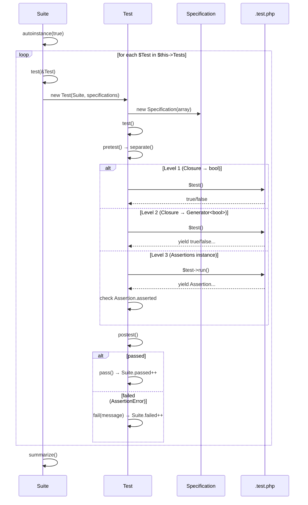
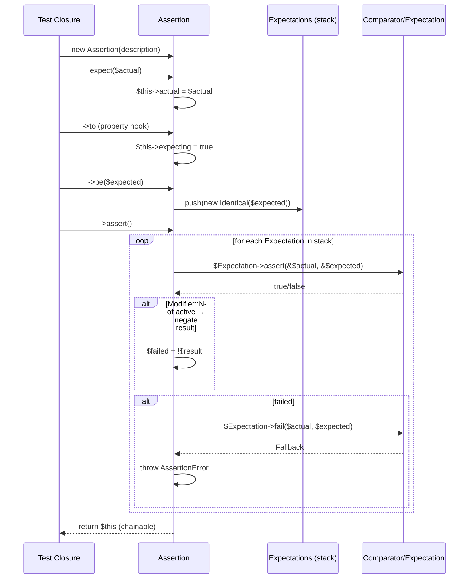
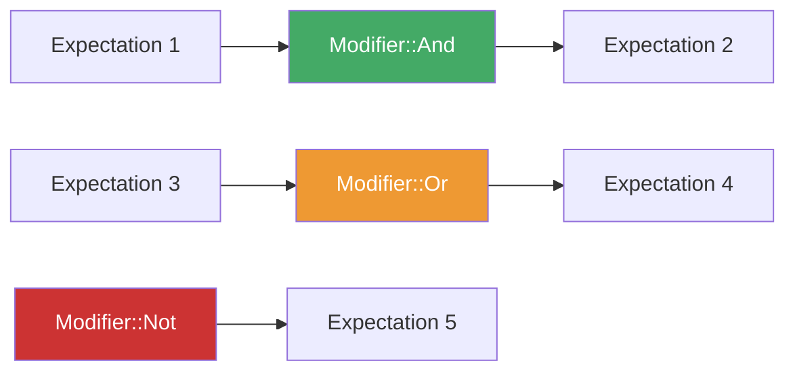

# ACI Tests — Architecture

> Last updated: 2026-03-11

## Overview

`Bootgly\ACI\Tests` is the built-in test framework for Bootgly. It lives in the **ACI** (Abstract Common Interface) layer and provides a **progressive API** with three levels of increasing expressiveness: returning booleans (Level 1), yielding booleans via Generators (Level 2), and fluent `Assertion` objects with chainable expectations (Level 3).

### Responsibilities

- **Discover & load** test files via `@.php` registry pattern
- **Orchestrate** test suites (`Suites`) → individual suite (`Suite`) → test cases (`Test`)
- **Assert** values using a composable expectation pipeline (`Assertion` + `Expectations`)
- **Report** pass/fail/skip results with colored CLI output
- **Snapshot** values for regression testing (memory or file storage)

### Design Principles

| Principle | How it applies |
|-----------|---------------|
| One-way policy | Single test framework — no PHPUnit, no alternatives |
| Minimum dependency | Zero third-party packages; uses only ABI + ACI internals |
| Progressive API | Users start simple (return bool) and graduate to advanced (fluent Assertions) |
| Generator-based | Multi-assertion test cases use PHP Generators (`yield`) for lazy evaluation |
| Composable expectations | Expectations are pushed onto a stack and evaluated sequentially with modifiers (`not`, `and`, `or`) |

---

## Namespace Structure

```
Bootgly/ACI/Tests/
├── Asserting.php                          # interface  — core assertion contract
├── Assertion.php                          # class      — single assertion (Level 3 core)
├── Assertions.php                         # class      — assertion collection runner
├── Suite.php                              # class      — single test suite
├── Suites.php                             # class      — test suite collection runner
│
├── Asserting/                             # ── Assertion support types ──
│   ├── Actual.php                         # trait   — holds $actual value
│   ├── Expected.php                       # trait   — holds $expected value
│   ├── Fallback.php                       # class   — failure message renderer
│   ├── Fallbacking.php                    # interface — fail() contract
│   ├── Modifier.php                       # enum    — Not, And, Or
│   ├── Output.php                         # interface — output() contract
│   └── Subassertion.php                   # abstract class — nested assertion base
│
├── Assertion/                             # ── Assertion internals ──
│   ├── Auxiliaries.php                    # enum    — auxiliary type selector
│   ├── Comparator.php                     # abstract class — comparison base
│   ├── Comparators.php                    # trait   — compare() entry-point
│   ├── Expectation.php                    # trait   — expectation stack manager
│   ├── Expectations.php                   # abstract class — fluent chain entry-point
│   ├── Snapshot.php                       # abstract class — snapshot base
│   ├── Snapshots.php                      # trait   — snapshot helpers on Assertion
│   │
│   ├── Auxiliaries/                       # ── Enum auxiliaries ──
│   │   ├── In.php                         # enum — ArrayKeys, ArrayValues, etc.
│   │   ├── Interval.php                   # enum — Closed, Open, LeftOpen, RightOpen
│   │   ├── Op.php                         # enum — ==, ===, >, <, >=, <=, !=, !==
│   │   ├── Type.php                       # enum — Array, Boolean, String, etc.
│   │   ├── Typehitting.php                # enum — Falsy, Truthy
│   │   └── Value.php                      # enum — Even, Odd, Positive, Negative, etc.
│   │
│   ├── Comparators/                       # ── Comparator implementations ──
│   │   ├── Equal.php                      # ==
│   │   ├── GreaterThan.php                # >
│   │   ├── GreaterThanOrEqual.php         # >=
│   │   ├── Identical.php                  # === (default)
│   │   ├── LessThan.php                   # <
│   │   ├── LessThanOrEqual.php            # <=
│   │   ├── NotEqual.php                   # !=
│   │   └── NotIdentical.php              # !==
│   │
│   ├── Expectation/                       # ── Abstract expectation categories ──
│   │   ├── Behavior.php                   # abstract — type/value assertions
│   │   ├── Caller.php                     # abstract — callable precondition
│   │   ├── Delimiter.php                  # abstract — range/interval assertions
│   │   ├── Finder.php                     # abstract — needle-in-haystack assertions
│   │   ├── Matcher.php                    # abstract — pattern-matching assertions
│   │   ├── Thrower.php                    # abstract — exception assertions
│   │   └── Waiter.php                     # abstract — timeout assertions (extends Subassertion)
│   │
│   ├── Expectations/                      # ── Expectation trait entry-points + implementations ──
│   │   ├── Behaviors.php                  # trait — be() method
│   │   ├── Behaviors/                     #   14× TypeXxx + 6× ValueXxx
│   │   ├── Callers.php                    # trait — call() method
│   │   ├── Callers/CallClosure.php        #
│   │   ├── Delimiters.php                 # trait — delimit() method
│   │   ├── Delimiters/                    #   ClosedInterval, OpenInterval, LeftOpen, RightOpen
│   │   ├── Finders.php                    # trait — find() method
│   │   ├── Finders/                       #   Contains, EndsWith, StartsWith, InArrayKeys, etc.
│   │   ├── Matchers.php                   # trait — match() method
│   │   ├── Matchers/                      #   Regex, VariadicDirPath
│   │   ├── Throwers.php                   # trait — throw() method
│   │   ├── Throwers/                      #   ThrowError, ThrowException, ThrowThrowable
│   │   ├── Waiters.php                    # trait — wait() method
│   │   └── Waiters/RunTimeout.php         #
│   │
│   └── Snapshots/                         # ── Snapshot implementations ──
│       ├── MemoryDefaultSnapshot.php      # in-memory snapshot storage
│       └── FileStorageSnapshot.php        # file-based snapshot storage
│
├── Assertions/                            # ── Assertions (collection) support ──
│   ├── Hook.php                           # enum — BeforeAll, AfterAll, BeforeEach, AfterEach
│   └── Hooks/                             # (reserved for future hook implementations)
│
├── Suite/                                 # ── Suite internals ──
│   ├── Test.php                           # class — single test case executor & reporter
│   └── Test/
│       ├── Specification.php              # class — test case config parsed from array
│       └── Specification/
│           └── Separator.php              # class — visual separator config
│
├── Suites/                                # ── Suites (collection) support ──
│   └── Reports/                           # (reserved for future report formats)
│
├── templates/                             # test file templates
├── tests/                                 # self-tests (@.php + *.test.php)
└── docs/
    └── ROADMAP.md
```

---

## Class Diagram

```mermaid
classDiagram
    direction TB

    %% ━━━ Core Interfaces & Enums ━━━
    class Asserting {
        <<interface>>
        +assert(&$actual, &$expected) bool
    }
    class Fallbacking {
        <<interface>>
        +fail($actual, $expected, $verbosity) Fallback
    }
    Asserting --|> Fallbacking : extends

    class Modifier {
        <<enum>>
        Not
        And
        Or
    }

    %% ━━━ Orchestration ━━━
    class Suites {
        +directories: array
        +failed / passed / skipped: int
        +iterate(suite, case, iterator) void
        +summarize() void
    }

    class Suite {
        +autoBoot / autoInstance / autoReport / autoSummarize
        +name: string
        +tests: array~string~
        +Tests: array~array~
        +Test: Test
        +autoboot(pathbase) void
        +autoinstance(instance) void
        +test(&Test) Test│null
        +skip(info) void
        +summarize() void
    }

    class Test {
        +Suite: Suite
        +Specification: Specification
        +descriptions: array
        -results: array~bool│null~
        -pretest() bool
        +test(...arguments) void
        -postest() void
        +pass() void
        +fail(message) void
    }

    class Specification {
        +description: string│null
        +Separator: Separator
        +skip: bool
        +ignore: bool
        +retest: Closure│null
        +test: Assertions│Closure
        +case: null│int %%private set%%
        +last: null│true %%private set%%
        +index(case, last) void
    }

    class Separator {
        +line: bool│string│null
        +left: string│null
        +header: string│null
    }

    Suites --> Suite : iterates
    Suite --> Test : creates
    Test --> Specification : reads config
    Specification --> Separator : contains

    %% ━━━ Assertion (Level 3) ━━━
    class Assertion {
        +$description: string│null
        +$fallback: string│null
        +asserted: bool
        +expect($actual) self
        +assert($actual, $expected, $using) self
        +skip() self
        +fail(Fallback) void
    }

    class Expectations {
        <<abstract>>
        +$to: self
        +$not: self
        +$and: self
        +$or: self
        +expect($actual, ?Op, $expected) self
        +iterate(Closure) self
    }
    Assertion --|> Expectations : extends

    class Expectation_trait {
        <<trait Expectation>>
        #expectations: array
        #expecting: bool
        #get() Asserting│Modifier│null
        #push(Asserting│Modifier) void
        #reset() void
    }
    Expectations ..> Expectation_trait : uses

    class Snapshots_trait {
        <<trait Snapshots>>
        +Snapshot: Snapshot
        +capture(name) self
        +restore(name) self
        +snapshot(name) self
    }
    Assertion ..> Snapshots_trait : uses

    %% ━━━ Assertions (collection) ━━━
    class Assertions {
        -Closure: Closure
        -results: array
        -arguments: array
        +on(Hook, Callback) self
        +input(...data) self
        +run(...arguments) Generator
    }

    class Hook {
        <<enum>>
        BeforeAll
        AfterAll
        BeforeEach
        AfterEach
    }
    Assertions --> Hook : uses

    %% ━━━ Comparators ━━━
    class Comparator {
        <<abstract>>
        +expected: mixed
    }
    Comparator ..|> Asserting : implements

    class Identical
    class Equal
    class GreaterThan
    class LessThan
    class GreaterThanOrEqual
    class LessThanOrEqual
    class NotEqual
    class NotIdentical
    Identical --|> Comparator
    Equal --|> Comparator
    GreaterThan --|> Comparator
    LessThan --|> Comparator
    GreaterThanOrEqual --|> Comparator
    LessThanOrEqual --|> Comparator
    NotEqual --|> Comparator
    NotIdentical --|> Comparator

    %% ━━━ Expectation categories ━━━
    class Behavior {
        <<abstract>>
    }
    Behavior ..|> Asserting

    class Finder {
        <<abstract>>
        +needle: mixed
    }
    Finder ..|> Asserting

    class Delimiter {
        <<abstract>>
        +min, max
    }
    Delimiter ..|> Asserting

    class Matcher {
        <<abstract>>
        +pattern: string
    }
    Matcher ..|> Asserting

    class Thrower {
        <<abstract>>
        +expected: Throwable
        +arguments: array
    }
    Thrower ..|> Asserting

    class Subassertion {
        <<abstract>>
        +subassertion: Closure│null
    }
    class Waiter {
        <<abstract>>
        +expected: int│float
        +arguments: array
        +duration: float
    }
    Waiter --|> Subassertion
    Waiter ..|> Asserting

    class Caller {
        <<abstract>>
        +arguments: array
    }
    Caller ..|> Asserting

    %% ━━━ Snapshots ━━━
    class Snapshot {
        <<abstract>>
        +name: string│null
        +captured / restored: bool
        +capture(snapshot, data) bool
        +restore(snapshot, &data) bool
        +assert(&actual, &expected) bool
    }
    Snapshot ..|> Asserting

    class MemoryDefaultSnapshot
    class FileStorageSnapshot
    MemoryDefaultSnapshot --|> Snapshot
    FileStorageSnapshot --|> Snapshot

    %% ━━━ Support ━━━
    class Fallback {
        +format: string
        +values: array
        +verbosity: int
        +__toString() string
    }

    class Actual {
        <<trait>>
        +actual: mixed
    }
    class Expected {
        <<trait>>
        +expected: mixed
    }
    class Output_interface {
        <<interface Output>>
        +output() void
    }
    Subassertion ..|> Output_interface : implements
    Subassertion ..> Actual : uses
```



---

## Execution Flow

### 1. Bootstrap (`tests/@.php` → `Suites` → `Suite`)



### 2. Suite → Test Case execution



### 3. Assertion (Level 3) — expect → to → be → assert



### 4. Modifier pipeline (not, and, or)



**Rules:**
- `Not` → inverts the result of the **next** expectation
- `And` → **both** expectations must pass (short-circuits on first fail after `And`)
- `Or` → **either** expectation can pass (skips failure if `Or` is active)
- `And` and `Or` are **mutually exclusive** — cannot be combined

---

## Dependency Graph

```mermaid
graph TD
    subgraph "Layer 1 — ABI"
        ABI_Argument["ABI\Argument"]
        ABI_Backtrace["ABI\Debugging\Backtrace"]
        ABI_Vars["ABI\Debugging\Data\Vars"]
        ABI_Template["ABI\Templates\Template"]
        ABI_File["ABI\IO\FS\File"]
        ABI_Setupables["ABI\Configs\Setupables"]
    end

    subgraph "Layer 2 — ACI (sibling)"
        ACI_Benchmark["ACI\Benchmark"]
        ACI_LoggableEscaped["ACI\Logs\LoggableEscaped"]
    end

    subgraph "Layer 4 — API"
        API_Environment["API\Environment"]
    end

    subgraph "ACI\Tests — Orchestration"
        Suites["Suites"]
        Suite["Suite"]
        Test["Suite\Test"]
        Specification["Specification"]
        Separator["Separator"]
    end

    subgraph "ACI\Tests — Assertion Core"
        Asserting_iface["«interface» Asserting"]
        Assertion_class["Assertion"]
        Assertions_class["Assertions"]
        Fallback_class["Fallback"]
        Modifier_enum["«enum» Modifier"]
        Expectation_trait["«trait» Expectation"]
        Expectations_abs["«abstract» Expectations"]
    end

    subgraph "ACI\Tests — Comparators"
        Comparator_abs["«abstract» Comparator"]
        Identical_cls["Identical"]
        Equal_cls["Equal"]
        GT_cls["GreaterThan"]
        LT_cls["LessThan"]
        GTE_cls["GreaterThanOrEqual"]
        LTE_cls["LessThanOrEqual"]
        NE_cls["NotEqual"]
        NI_cls["NotIdentical"]
    end

    subgraph "ACI\Tests — Expectation Categories"
        Behavior_abs["«abstract» Behavior"]
        Finder_abs["«abstract» Finder"]
        Delimiter_abs["«abstract» Delimiter"]
        Matcher_abs["«abstract» Matcher"]
        Thrower_abs["«abstract» Thrower"]
        Waiter_abs["«abstract» Waiter"]
        Caller_abs["«abstract» Caller"]
    end

    subgraph "ACI\Tests — Snapshots"
        Snapshot_abs["«abstract» Snapshot"]
        MemorySnap["MemoryDefaultSnapshot"]
        FileSnap["FileStorageSnapshot"]
    end

    %% Layer dependencies
    Suites --> ACI_Benchmark
    Suites --> ACI_LoggableEscaped
    Suite --> ACI_Benchmark
    Suite --> ACI_LoggableEscaped
    Suite --> API_Environment
    Test --> ACI_Benchmark
    Test --> ACI_LoggableEscaped

    Assertion_class --> ABI_Argument
    Assertion_class --> ABI_Backtrace
    Assertion_class --> ABI_Vars
    Assertion_class --> ABI_Template
    Comparator_abs --> ABI_Argument
    Expectations_abs --> ABI_Argument
    Snapshot_abs --> ABI_Backtrace
    FileSnap --> ABI_File

    %% Internal relationships
    Suites --> Suite
    Suite --> Test
    Test --> Specification
    Specification --> Separator
    Test --> Assertion_class
    Test --> Assertions_class

    Assertion_class --> Expectations_abs
    Expectations_abs --> Expectation_trait
    Expectations_abs --> Comparator_abs
    Assertion_class --> Asserting_iface

    Comparator_abs -.-> Asserting_iface
    Behavior_abs -.-> Asserting_iface
    Finder_abs -.-> Asserting_iface
    Delimiter_abs -.-> Asserting_iface
    Matcher_abs -.-> Asserting_iface
    Thrower_abs -.-> Asserting_iface
    Waiter_abs -.-> Asserting_iface
    Caller_abs -.-> Asserting_iface
    Snapshot_abs -.-> Asserting_iface

    Identical_cls --> Comparator_abs
    Equal_cls --> Comparator_abs
    GT_cls --> Comparator_abs
    LT_cls --> Comparator_abs
    GTE_cls --> Comparator_abs
    LTE_cls --> Comparator_abs
    NE_cls --> Comparator_abs
    NI_cls --> Comparator_abs

    MemorySnap --> Snapshot_abs
    FileSnap --> Snapshot_abs
```



---

## Layer Dependency Validation

| Source | Depends on | Layer rule | Status |
|--------|-----------|------------|--------|
| `Suites`, `Suite`, `Test` | `ACI\Benchmark`, `ACI\Logs\LoggableEscaped` | ACI → ACI (sibling) | **OK** |
| `Assertion`, `Comparator`, `Expectations` | `ABI\Argument` | ACI → ABI | **OK** |
| `Assertion` | `ABI\Debugging\Backtrace`, `ABI\Debugging\Data\Vars`, `ABI\Templates\Template` | ACI → ABI | **OK** |
| `Snapshot` | `ABI\Debugging\Backtrace` | ACI → ABI | **OK** |
| `FileStorageSnapshot` | `ABI\IO\FS\File` | ACI → ABI | **OK** |
| `Hook` | `ABI\Configs\Setupables` | ACI → ABI | **OK** |
| `Suite` | `API\Environment` | ACI → API | **⚠️ VIOLATION** |

### Detected Violation

`Suite.php` imports `Bootgly\API\Environment` (Layer 4) from the ACI layer (Layer 2). ACI should only depend on ABI and itself. This is used to skip private test files when running in CI/CD mode (`Environment::match(Environment::CI_CD)`).

**Suggested fix**: Move the CI/CD detection to a lower-layer mechanism (e.g., an environment variable check in ABI or a configuration flag injected into Suite) to eliminate the upward dependency.

---

## Expectation API — Trait Composition

The fluent `->to->be()` / `->to->find()` / etc. chain is built via trait composition on `Expectations`:

```
Assertion (class)
  └── extends Expectations (abstract class)
        ├── uses Expectation (trait)        → stack management: push(), get(), reset()
        │     ├── uses Actual (trait)       → $actual
        │     └── uses Expected (trait)     → $expected
        ├── uses Behaviors (trait)          → be($expected)
        ├── uses Callers (trait)            → call(...$arguments)
        ├── uses Delimiters (trait)         → delimit($from, $to, $interval)
        ├── uses Finders (trait)            → find($haystack, $needle)
        ├── uses Matchers (trait)           → match($pattern)
        ├── uses Throwers (trait)           → throw($expected)
        └── uses Waiters (trait)            → wait($expected)
  └── uses Snapshots (trait)               → capture(), restore(), snapshot()
```

Each fluent method (e.g., `be()`, `find()`) creates a concrete implementation of an `Asserting` interface and pushes it onto the expectations stack. The `assert()` method then iterates the stack, applying `Modifier` logic.

---

## Test File Specification (`.test.php` format)

Each test file returns a `new Specification(...)` instance with named parameters:

### Base Specification (`ACI\Tests\Suite\Test\Specification`)

```php
use Bootgly\ACI\Tests\Suite\Test\Specification;
use Bootgly\ACI\Tests\Suite\Test\Specification\Separator;

return new Specification(
    // * Data (required)
    test: Assertions|Closure,           // test logic

    // * Config (optional)
    description: null|string,           // test case description
    Separator: null|Separator,          // visual separator (Separator value object)
    skip: bool,                         // skip with output (default: false)
    ignore: bool,                       // skip silently (default: false)
    retest: null|Closure,               // re-run closure on pass/fail
);
```

### Separator value object (`ACI\Tests\Suite\Test\Specification\Separator`)

```php
new Separator(
    line: null|bool|string,    // visual separator line (e.g., 'Request', true)
    left: null|string,         // left margin text (e.g., 'HTTP/1.1 Caching Specification (RFC 7234)')
    header: null|string,       // centered header (e.g., '@upload')
)
```

### E2E Specification (`WPI\Nodes\HTTP_Server_CLI\Tests\Suite\Test\Specification`)

Extends the base `Specification` with HTTP-specific parameters:

```php
use Bootgly\WPI\Nodes\HTTP_Server_CLI\Tests\Suite\Test\Specification;
use Bootgly\ACI\Tests\Suite\Test\Specification\Separator;

return new Specification(
    // * Config (optional - inherited)
    description: null|string,
    Separator: null|Separator,
    skip: bool,
    ignore: bool,
    retest: null|Closure,

    // * Data (required - E2E)
    request: Closure,                   // returns raw HTTP request string
    response: Closure,                  // server-side handler (Request, Response): Response
    test: Assertions|Closure,           // assertion on raw response

    // * Data (optional - E2E)
    middlewares: array<Middleware>,      // middleware instances for this test
    responseLength: null|int,           // expected HTTP response length
);
```

### Metadata (injected by Suite at runtime)

| Property | Type | Description |
|----------|------|-------------|
| `$case` | `null\|int` | Test case index + 1 (auto-set via `index()`) |
| `$last` | `null\|true` | Last case flag (auto-set via `index()`) |

---

## Progressive API Levels

### Level 1 — Boolean return

```php
use Bootgly\ACI\Tests\Suite\Test\Specification;

return new Specification(
    description: 'X should equal X',

    test: function (): bool {
        return 1 === 1;
    }
);
```

### Level 2 — Generator yielding booleans

```php
use Generator;

use Bootgly\ACI\Tests\Assertion;
use Bootgly\ACI\Tests\Suite\Test\Specification;

return new Specification(
    test: function (): Generator {
        yield 1 === 1;

        Assertion::$description = 'Two equals two';
        yield 2 === 2;
    }
);
```

### Level 3 — Fluent Assertions

```php
use Bootgly\ACI\Tests\Assertion;
use Bootgly\ACI\Tests\Assertion\Auxiliaries\Value;
use Bootgly\ACI\Tests\Assertions;
use Bootgly\ACI\Tests\Suite\Test\Specification;

return new Specification(
    description: 'It should test values',

    test: new Assertions(Case: function (): Generator {
        yield (new Assertion(description: 'X should equal X'))
            ->expect(1)
            ->to->be(1)
            ->assert();

        yield (new Assertion(description: 'X should be positive'))
            ->expect(42)
            ->to->be(Value::Positive)
            ->assert();
    })
);
```

---

## Design Decisions

- **Generator-based test iteration**: Each test case can `yield` multiple assertions. This allows lazy evaluation and individual per-assertion reporting without needing a `describe`/`it` DSL.
- **Expectations as a stack**: Instead of method chaining that evaluates immediately, expectations are accumulated and resolved in `assert()`. This enables modifier composition (`not`, `and`, `or`).
- **`Asserting` as the universal contract**: Every expectation category (Comparator, Behavior, Finder, Delimiter, Matcher, Thrower, Waiter) and Snapshot implement the same `Asserting` interface, making them interchangeable in the pipeline.
- **Subassertion pattern (Waiter)**: `Waiter` extends `Subassertion` to allow nested assertions on output values (e.g., asserting the duration of a timed operation). The `output()` interface enables extraction of computed metadata.
- **Static `$description` and `$fallback`**: These are static on `Assertion` to allow Level 2 (plain boolean yields) to attach descriptions without requiring an `Assertion` object instance.
- **`Specification` as a value object**: Each `.test.php` file returns `new Specification(...)` with named parameters. The base class (`ACI\Tests\Suite\Test\Specification`) handles config + test logic; E2E tests use a subclass (`WPI\...\Specification`) that adds `$request`, `$response`, and `$middlewares`. Metadata (`$case`, `$last`) is injected at runtime via `index()` with asymmetric visibility (`public private(set)`). Visual separators use the `Separator` value object instead of flat keys.
- **Snapshot abstraction**: `Snapshot` base class with `capture`/`restore` allows swappable storage backends (memory for speed, file for persistence) without changing assertion logic.
