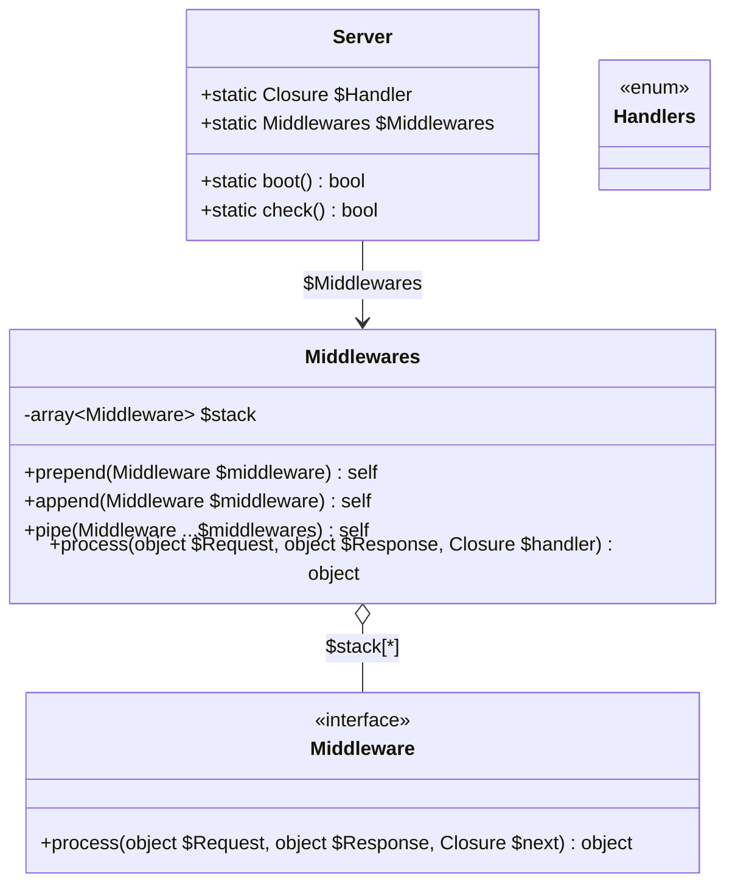
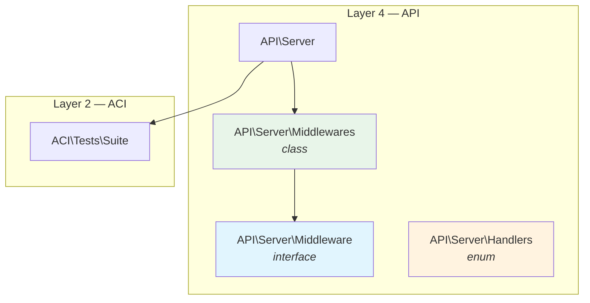

# API/Server — Middleware Pipeline Architecture

> Last updated: 2026-03-07

## Overview

The `API/Server` module owns the **middleware pipeline engine** — a protocol-agnostic
execution layer that wraps any handler with an ordered chain of interceptors (middlewares).

It lives in `API/` (layer 4) because:
- It depends only on `ACI/` (layer 2) for testing — no WPI imports
- Both `CLI/` and `WPI/` (layers 5–6) can consume it
- The existing `Server.php` already holds `$Handler` — the pipeline extends this

The engine does **not** know about HTTP, TCP, Request, or Response concrete types.
It operates on `object` parameters, letting each interface layer (CLI/WPI) pass its own types.

## Current State

```
Bootgly/API/Server/
├── Middleware.php      ← empty placeholder
├── Middlewares.php     ← empty placeholder
└── Handlers.php        ← empty placeholder
```

`Server.php` (parent directory) holds:
- `static Closure $Handler` — the user-defined request handler (SAPI)
- `static function boot()` — loads handler from production file
- `static function check()` — hot-reload detection

## Target State

```
Bootgly/API/
├── Server.php                  ← add static $Middlewares property
└── Server/
    ├── Middleware.php           ← interface (contract)
    ├── Middlewares.php          ← pipeline executor (collection)
    └── Handlers.php            ← enum of handler resolution strategies
```

## Namespace Structure

```
Bootgly\API\Server\Middleware       (interface)
Bootgly\API\Server\Middlewares      (class — pipeline executor)
Bootgly\API\Server\Handlers        (enum — handler resolver strategies)
```

## Class Diagram



## Detailed Design

### `Middleware` (interface)

```php
namespace Bootgly\API\Server;

use Closure;

interface Middleware
{
   public function process (object $Request, object $Response, Closure $next): object;
}
```

**Design decisions:**
- **Interface-only** (one-way policy) — no Closure middlewares accepted
- **`object` types** — protocol-agnostic; WPI passes `Request`/`Response`, CLI could pass its own
- **`$next` is a `Closure`** — the next middleware (or handler) in the pipeline, always `(object, object): object`
- **Returns `object`** — the (possibly modified) Response

**Naming:** `Middleware` is a substantive noun. The `-ing` suffix convention doesn't apply
naturally ("Middlewaring" is artificial). This is a pragmatic exception, consistent with
the term's universal usage.

### `Middlewares` (class — pipeline executor)

```php
namespace Bootgly\API\Server;

use function array_reduce;
use function array_reverse;
use Closure;

class Middlewares
{
   // * Config
   // ...

   // * Data
   /** @var array<Middleware> */
   private array $stack = [];

   // * Metadata
   // ...


   public function prepend (Middleware $middleware): self
   {
      // @
      array_unshift($this->stack, $middleware);
      // :
      return $this;
   }

   public function append (Middleware $middleware): self
   {
      // @
      $this->stack[] = $middleware;
      // :
      return $this;
   }

   public function pipe (Middleware ...$middlewares): self
   {
      // @
      foreach ($middlewares as $middleware) {
         $this->stack[] = $middleware;
      }
      // :
      return $this;
   }

   public function process (object $Request, object $Response, Closure $handler): object
   {
      // ? No middlewares — call handler directly
      if ($this->stack === []) {
         return $handler($Request, $Response);
      }

      // @ Build the onion from inside out (fold right)
      $pipeline = array_reduce(
         array_reverse($this->stack),
         function (Closure $next, Middleware $middleware): Closure {
            return function (object $Request, object $Response) use ($middleware, $next): object {
               return $middleware->process($Request, $Response, $next);
            };
         },
         $handler
      );

      // :
      return $pipeline($Request, $Response);
   }
}
```

**Algorithm: Array reduction (fold right)**

The stack `[A, B, C]` with handler `H` produces:

```
A.process(Req, Res, fn() =>
   B.process(Req, Res, fn() =>
      C.process(Req, Res, fn() =>
         H(Req, Res)
      )
   )
)
```

Execution order (onion):
```
A (before) → B (before) → C (before) → H → C (after) → B (after) → A (after)
```

**Why array reduction over Generators:**
- Middleware needs bidirectional control (before/after) — Generators complicate this
- `array_reduce` is a single allocation per request, no iterator overhead
- Universally understood pattern, trivial to debug
- With interface-only typing, PHPStan infers everything at level 9

**Short-circuit optimization:** When `$this->stack === []` (no middlewares registered),
the handler is called directly — zero overhead for the common case.

### `Handlers` (enum)

```php
namespace Bootgly\API\Server;

enum Handlers
{
   // Handler resolver strategies (future expansion)
   // e.g., case Closure; case Controller; case Invokable;
}
```

Currently minimal. Reserved for future handler resolution strategies when
the framework needs to resolve handlers beyond simple Closures (e.g., controller classes).

### `Server.php` modification

Add a single static property:

```php
// * Data
public static Closure $Handler;
public static Middlewares $Middlewares;  // ← NEW
```

## Dependency Graph



**Layer compliance:** API depends only on ACI (layer 2) — no cross-layer violations.

## Integration Point

The pipeline is invoked in `WPI/Nodes/HTTP_Server_CLI/Encoders/Encoder_.php`.
This is NOT an API-layer concern — it's the WPI integration point documented in
the WPI architecture.

**Before** (current `Encoder_.php`):
```php
$Result = (SAPI::$Handler)($Request, $Response, $Router);
```

**After** (with pipeline):
```php
$Result = SAPI::$Middlewares->process($Request, $Response,
   function (object $Request, object $Response) use ($Router): object {
      return (SAPI::$Handler)($Request, $Response, $Router);
   }
);
```

Both `Encoder_.php` and `Encoder_Testing.php` need this same integration.

## Design Decisions

1. **Interface-only (one-way policy)** — Closures are NOT accepted as middleware.
   Full PHPStan level 9 type safety, IDE autocompletion, clear contracts.

2. **`object` parameter types** — Keeps the engine protocol-agnostic.
   WPI passes HTTP Request/Response; a future CLI middleware could pass Command/Output.

3. **Static `$Middlewares` on `Server`** — Follows the existing pattern where `Server`
   holds static state (`$Handler`, `$Environment`, `$Suite`). The pipeline is a
   server-level concern, not per-request.

4. **Empty stack fast path** — `if ($this->stack === [])` avoids `array_reduce` when
   no middlewares are registered, maintaining zero overhead for simple setups.
