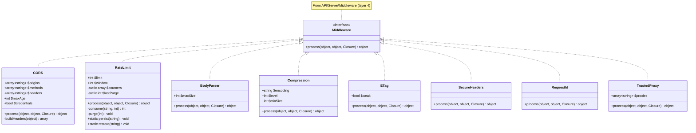

# WPI/Modules/HTTP/Server/Router — Middleware Integration Architecture

> Last updated: 2026-03-07

## Overview

The WPI layer provides **built-in HTTP middlewares** and integrates the `API/Server` pipeline
engine into the HTTP request lifecycle. This covers:

1. **Built-in middleware classes** in `Router/Middlewares/`
2. **Router integration** — `intercept()` method + `middlewares:` parameter on `route()`
3. **Encoder integration** — wrapping the SAPI handler call with the pipeline

## Current State

```
Bootgly/WPI/Modules/HTTP/Server/
├── Router.php              ← Router class (route matching, routing)
├── Router/
│   ├── &/                  ← drafts (Routes.php, Zero_Configuration_Resolution.php)
│   └── Middlewares/        ← empty directory
├── Route.php               ← Route class (params, nesting)
├── Response.php            ← abstract Response
└── Response/
    ├── Authentication.php  ← interface
    └── Authentication/
        └── Basic.php

Bootgly/WPI/Nodes/HTTP_Server_CLI/
├── Encoders/
│   ├── Encoder_.php         ← production encoder (calls SAPI::$Handler)
│   └── Encoder_Testing.php  ← test encoder (calls SAPI::$Handler)
└── ...
```

## Target State

```
Bootgly/WPI/Modules/HTTP/Server/
├── Router.php                      ← add intercept(), modify route()
├── Router/
│   ├── Middlewares/
│   │   ├── BodyParser.php          ← max size + Content-Type validation
│   │   ├── Compression.php         ← gzip/deflate opt-in
│   │   ├── CORS.php                ← preflight + origin headers
│   │   ├── ETag.php                ← HTTP caching (If-None-Match)
│   │   ├── RateLimit.php           ← in-memory counters + file persist
│   │   ├── RequestId.php           ← X-Request-Id UUID
│   │   ├── SecureHeaders.php       ← security headers (CSP, HSTS, etc.)
│   │   └── TrustedProxy.php        ← resolve real IP behind proxy
│   └── &/
└── ...

Bootgly/WPI/Nodes/HTTP_Server_CLI/
├── Encoders/
│   ├── Encoder_.php                ← wrap SAPI::$Handler with pipeline
│   └── Encoder_Testing.php         ← wrap SAPI::$Handler with pipeline
└── ...
```

## Namespace Structure

```
Bootgly\WPI\Modules\HTTP\Server\Router\Middlewares\BodyParser
Bootgly\WPI\Modules\HTTP\Server\Router\Middlewares\Compression
Bootgly\WPI\Modules\HTTP\Server\Router\Middlewares\CORS
Bootgly\WPI\Modules\HTTP\Server\Router\Middlewares\ETag
Bootgly\WPI\Modules\HTTP\Server\Router\Middlewares\RateLimit
Bootgly\WPI\Modules\HTTP\Server\Router\Middlewares\RequestId
Bootgly\WPI\Modules\HTTP\Server\Router\Middlewares\SecureHeaders
Bootgly\WPI\Modules\HTTP\Server\Router\Middlewares\TrustedProxy
```

All implement `Bootgly\API\Server\Middleware` (layer 4 → layer 6 dependency is valid).

## Class Diagram



## Dependency Graph

```mermaid
graph TD
    subgraph "Layer 6 — WPI"
        Router["Router.php"]
        CORS["Middlewares\CORS"]
        RateLimit["Middlewares\RateLimit"]
        BodyParser["Middlewares\BodyParser"]
        Compression["Middlewares\Compression"]
        ETag["Middlewares\ETag"]
        SecureHeaders["Middlewares\SecureHeaders"]
        RequestId["Middlewares\RequestId"]
        TrustedProxy["Middlewares\TrustedProxy"]
        Encoder["Encoders\Encoder_"]
        EncoderTest["Encoders\Encoder_Testing"]
    end

    subgraph "Layer 4 — API"
        Middleware["API\Server\Middleware<br/><i>interface</i>"]
        Middlewares["API\Server\Middlewares<br/><i>class</i>"]
        SAPI["API\Server"]
    end

    CORS --> Middleware
    RateLimit --> Middleware
    BodyParser --> Middleware
    Compression --> Middleware
    ETag --> Middleware
    SecureHeaders --> Middleware
    RequestId --> Middleware
    TrustedProxy --> Middleware

    Encoder --> SAPI
    Encoder --> Middlewares
    EncoderTest --> SAPI
    EncoderTest --> Middlewares

    Router -.->|"intercept()"| Middlewares

    style Middleware fill:#e1f5fe
    style Middlewares fill:#e8f5e9
```



**Layer compliance:** WPI (layer 6) imports from API (layer 4) — valid direction.
No reverse dependency. No cross-layer skip.

## Router Integration

### `intercept()` method

New method on `Router` for route-group middleware:

```php
public function intercept (Middleware ...$middlewares): void
{
   // @ Register middlewares for the current route group
   foreach ($middlewares as $middleware) {
      $this->middlewares[] = $middleware;
   }
}
```

**Property addition to Router:**
```php
// * Data
/** @var array<Middleware> */
private array $middlewares = [];
```

### `route()` modification

Add `middlewares` named parameter:

```php
public function route (
   string $route,
   callable $handler,
   null|string|array $methods = null,
   array $middlewares = []              // ← NEW
): false|object
```

When `$middlewares` is non-empty or `$this->middlewares` has entries, wrap the handler
call in a local pipeline before executing:

```php
// # Route Callback
if ($routed === 2) {
   // ...existing param extraction...

   // @ Merge route-level + group-level middlewares
   $merged = array_merge($this->middlewares, $middlewares);

   if ($merged !== []) {
      $pipeline = new Middlewares;
      $pipeline->pipe(...$merged);

      // @ Wrap handler in pipeline
      $originalHandler = $handler;
      $handler = function ($Request, $Response) use ($pipeline, $originalHandler, $Route) {
         return $pipeline->process($Request, $Response,
            function ($Request, $Response) use ($originalHandler, $Route) {
               if ($originalHandler instanceof Closure) {
                  $bound = $originalHandler->bindTo($Route, $Route);
                  return $bound($Request, $Response);
               }
               return call_user_func_array($originalHandler, [$Request, $Response, $Route]);
            }
         );
      };
   }

   // @ Call (existing code continues)
   ...
}
```

### Middleware reset on route group exit

When a nested route group ends (the Generator completes), group-level middlewares
registered via `intercept()` must be cleared:

```php
// In routing() method, after yield from:
$this->middlewares = [];
```

## Encoder Integration

Both `Encoder_.php` and `Encoder_Testing.php` need the same change — wrapping the
`SAPI::$Handler` call with the global pipeline:

### `Encoder_.php`

```php
// BEFORE:
$Result = (SAPI::$Handler)($Request, $Response, $Router);

// AFTER:
$Result = SAPI::$Middlewares->process($Request, $Response,
   function (object $Request, object $Response) use ($Router): object|Generator {
      return (SAPI::$Handler)($Request, $Response, $Router);
   }
);
```

### `Encoder_Testing.php`

Same pattern — wrap the `SAPI::$Handler` call.

## Built-in Middleware Details

### Execution Order (recommended)

When stacking globally, the recommended order is:

```
1. RequestId       ← assign ID early (available to all subsequent middlewares)
2. TrustedProxy    ← resolve real IP before rate limiting
3. SecureHeaders   ← set security headers on every response
4. CORS            ← handle preflight early, short-circuit OPTIONS
5. RateLimit       ← reject excess traffic before hitting heavier logic
6. Compression     ← wrap response encoding
7. ETag            ← compute after body is ready
8. BodyParser      ← validate/parse body before handler
```

### Property Organization (per Bootgly convention)

Each middleware class follows:
```php
class CORS implements Middleware
{
   // * Config    ← constructor-injected settings
   // * Data      ← runtime state (if any)
   // * Metadata  ← internal computed state (if any)

   public function __construct (...) {}
   public function process (...): object {}
}
```

### RateLimit — In-Memory Strategy

```
Hot path (per request):
  1. Check static::$counters[$ip] — O(1) hash lookup
  2. Increment or reset window — O(1)
  3. Periodic purge (every $window seconds) — O(n) expired keys

Persistence (NOT on hot path):
  - persist() → file_put_contents() — called on server shutdown signal
  - restore() → file_get_contents() — called on worker boot

Storage: workdata/cache/ratelimit.dat
Scope: per-worker (each forked worker has its own static array)
Precision: ~1/N of actual rate (N workers) — acceptable trade-off for zero I/O
```

### Compression — Middleware (not Response::encode)

Compression is opt-in via middleware, NOT built into `Response::encode()`.
The middleware checks `Accept-Encoding`, compresses the body, and sets
`Content-Encoding` header before the response is encoded to raw HTTP.

This keeps `Response::encode()` simple and compression explicitly activated.

## Three Levels of Middleware Registration

```
┌─────────────────────────────────────────────────────────────┐
│ Level 1: GLOBAL — $Middlewares->pipe()                      │
│ Runs for EVERY request, before Router                       │
│ Registered in: SAPI bootstrap / Server boot                 │
│ Stored in: SAPI::$Middlewares                               │
│ Executed in: Encoder_.php (wraps SAPI::$Handler)            │
├─────────────────────────────────────────────────────────────┤
│ Level 2: GROUP — $Router->intercept()                       │
│ Runs for matched route groups only                          │
│ Registered in: nested route Closure                         │
│ Stored in: Router::$middlewares (cleared on group exit)     │
│ Executed in: Router::route() (wraps handler)                │
├─────────────────────────────────────────────────────────────┤
│ Level 3: ROUTE — route(..., middlewares: [...])              │
│ Runs for a single matched route only                        │
│ Registered in: route() call                                 │
│ Merged with group middlewares                               │
│ Executed in: Router::route() (wraps handler)                │
└─────────────────────────────────────────────────────────────┘
```

## Full Request Lifecycle (with middleware)

```
TCP Connection
  → Decoder_.decode()
    → Request object populated

  → Encoder_.encode()
    → SAPI::$Middlewares->process(Request, Response,     ← GLOBAL pipeline
        function (Request, Response) {
          → SAPI::$Handler(Request, Response, Router)     ← user code
            → Router->route('/path', handler, 'GET')
              → [match?] → intercept() middlewares         ← GROUP pipeline
              → [match?] → route middlewares:[]             ← ROUTE pipeline
              → handler(Request, Response)
              ← Response
            ← Router response
          ← SAPI response
        }
      )
    ← Response (passed through all after-middlewares)

  → Response->encode()
    → raw HTTP string

  → TCP Send
```

## Design Decisions

1. **Middlewares in `Router/Middlewares/`** — co-located with Router because they intercept
   the HTTP request/response flow at the routing level. Not in `Nodes/HTTP_Server_CLI/`
   because they're HTTP-generic, not server-implementation-specific.

2. **`intercept()` verb** — Follows Bootgly method naming convention (single-word verb).
   Describes exactly what it does: intercepts the request before the handler.

3. **Group middleware reset** — `$this->middlewares = []` after nested route group completes.
   Prevents middleware leaking between groups in the same request.

4. **Merged middleware order** — Group middlewares run first (outer), then route middlewares
   (inner). This ensures group-level auth runs before route-specific logic.

5. **Both Encoders modified** — `Encoder_` (production) and `Encoder_Testing` (test mode)
   both need pipeline wrapping. Tests must exercise middleware behavior too.
